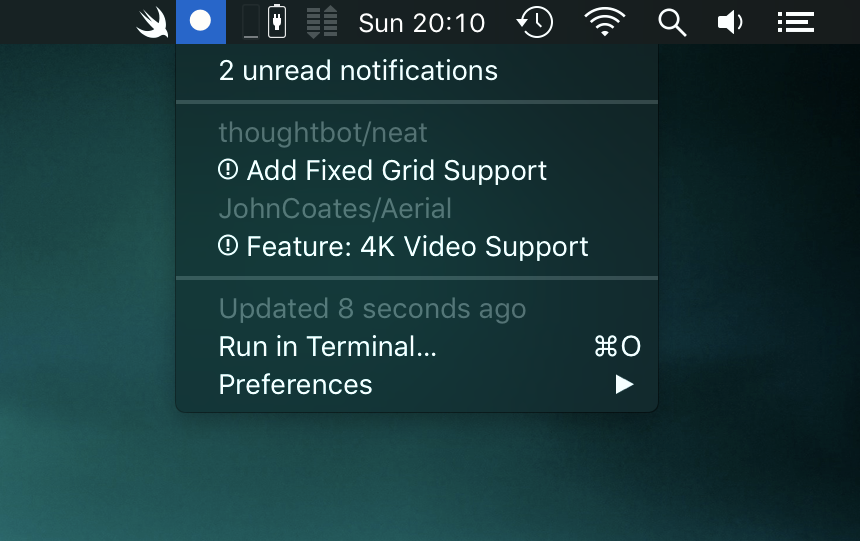

# Swift Trending for BitBar

A plugin for [BitBar](https://getbitbar.com) (free) to display all your GitHub notifications in the menubar.



## Install

BitBar needs to be installed. Download [here](https://github.com/matryer/bitbar/releases/latest).

Then you can either:

* _Option 1_: Drop the `github-notifications.1m.swift` file in your BitBar plugin directly.
* _Option 2_: Open this lins link in your browser: `bitbar://openPlugin?title=Github%20Notifications&src=https://raw.githubusercontent.com/kaishin/github-notifications-bitbar/master/github-notifications.1min.swift`

## Settings

You can change the following settings directly in the script file:

```swift
let GitHubAPIKey = "" // Set it to use your own GitHub API token key here.
var displayCount = false // Show the notification badge in the menubar.
```

If you want to change the update frequency, you can change the `1m` in the filename to your preferred duration.
